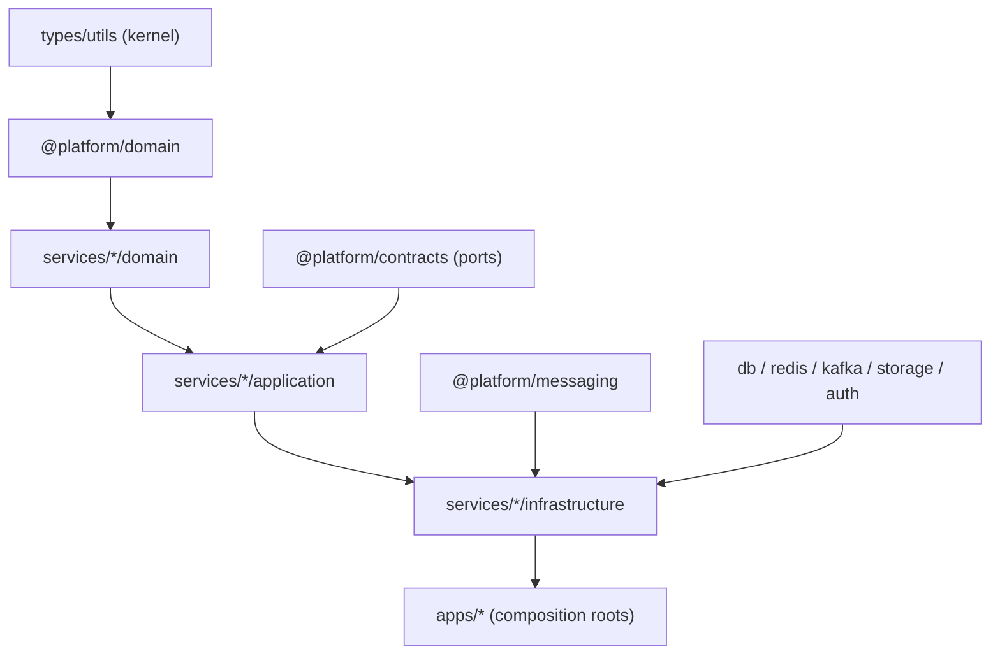
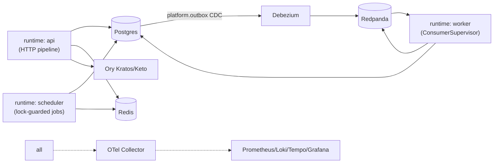
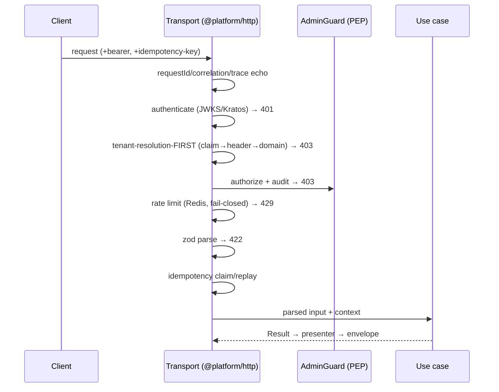
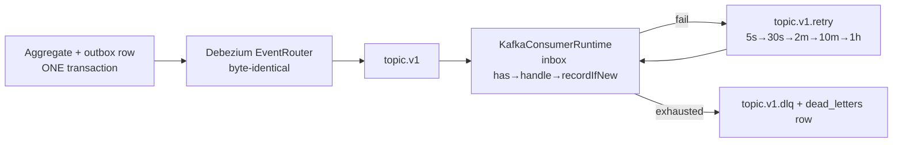
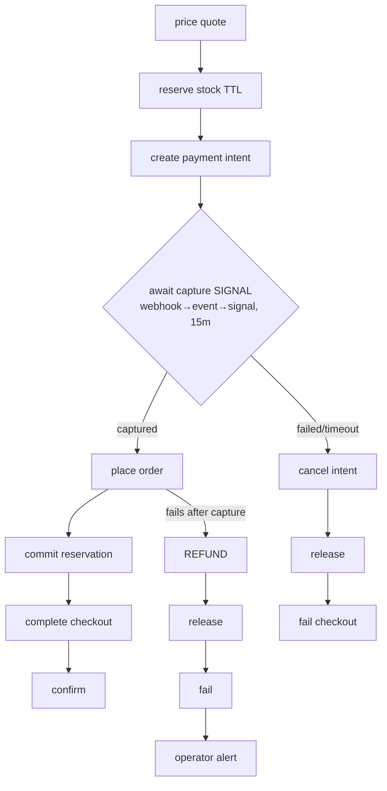
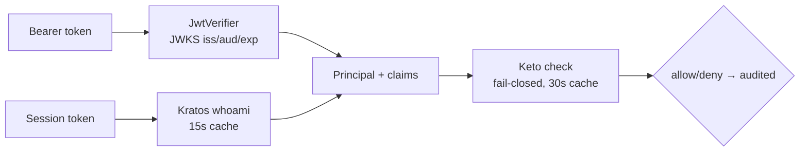

# ARCHITECTURE_OVERVIEW — diagrams (Sprint 3.0A)

> Generated views of the frozen architecture. Canonical prose: `architecture/` docs 01–26 +
> ADR-0001…0013. If a diagram disagrees with the code, the code + fitness functions win.

## Dependency graph (enforced by dependency-cruiser)

## Runtime graph (Sprint 2.9)

## Request lifecycle (D-047, fixed order)

## Event flow (ADR-0003/0005, doc 26 §3)

## Purchase flow (ADR-0012)

## Authentication flow (D-048)

## Package relationships

Kernel (`types/utils/domain/contracts`) ← contexts (`services/*`) ← infrastructure adapters
(`db/redis/kafka/storage/auth/http/grpc/temporal/messaging`) ← composition (`apps/admin`,
`apps/runtime`). Cross-context: integration events only (doc 20 §1.1); shared kernel = `Money` +
`ProductRef` (rule of three, D-029).
