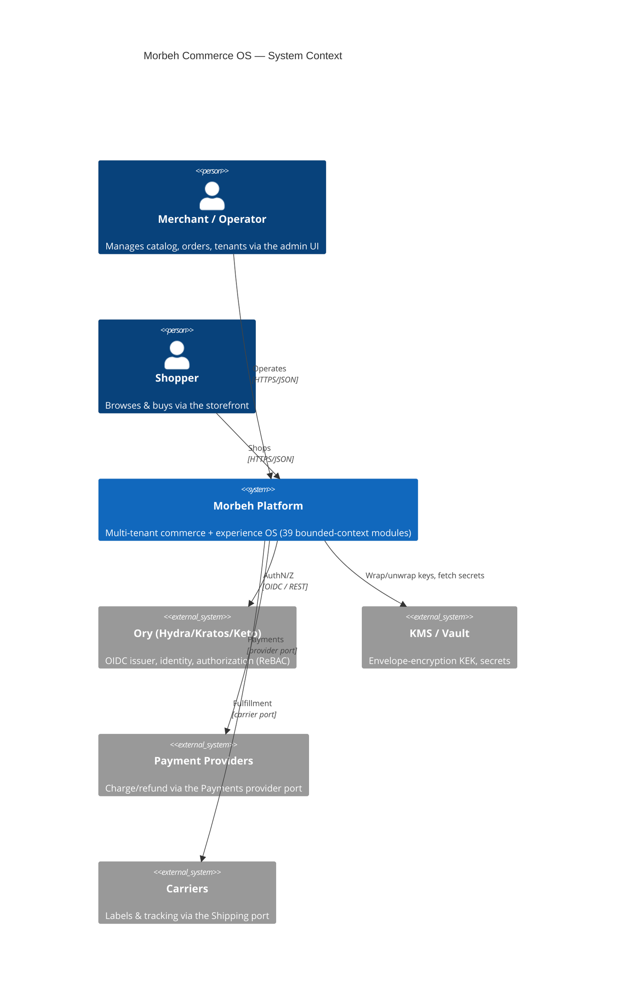
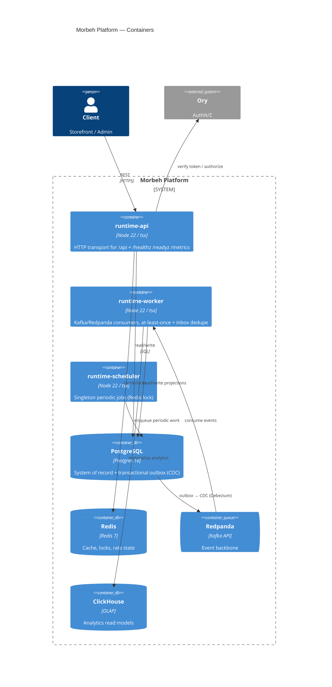
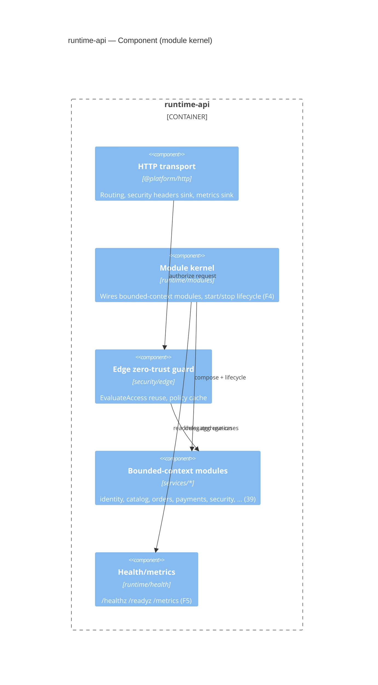

# C4 Architecture Diagrams

> H-5 production-readiness view. C4 levels 1–3 for the Morbeh platform, rendered as Mermaid. These
> summarise the architecture the 15 architecture docs + ADRs define — they do not introduce new
> structure. Context: one runtime image (`api`/`worker`/`scheduler`) composes the bounded-context
> modules over shared infrastructure.

## Level 1 — System Context

## Level 2 — Containers

## Level 3 — Runtime module composition (Component)

