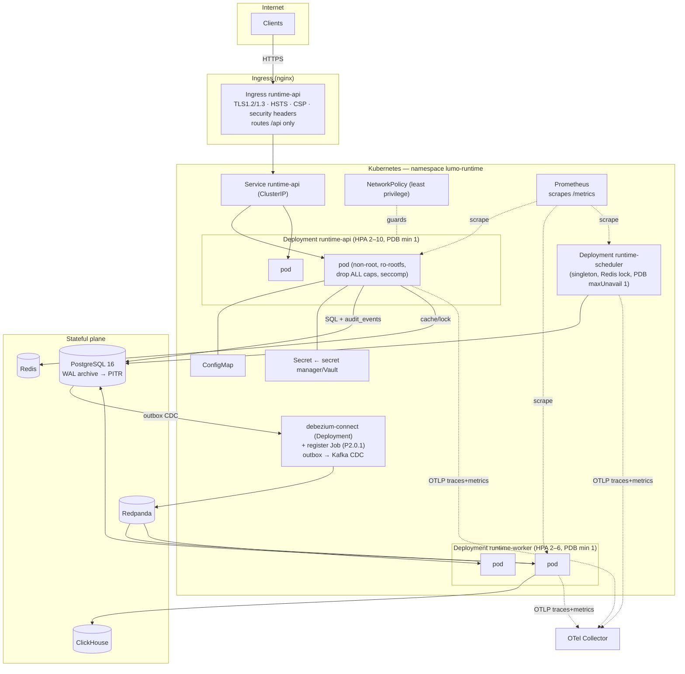

# Deployment Diagram

> H-5 — how the runtime is deployed on Kubernetes with the hardening controls from
> [`infrastructure/k8s`](../../../infrastructure/k8s). Zero-downtime rollout, HPA, PDB, NetworkPolicy,
> non-root read-only pods.

## Rollout properties

- **Zero-downtime**: `maxUnavailable: 0`, `maxSurge: 1`, `preStop` drain, 30s grace (10s bounded shutdown).
- **Resilience**: PDBs hold `minAvailable: 1` during node drains; topology spread + anti-affinity.
- **Isolation**: NetworkPolicy restricts pod traffic; ops endpoints never leave the cluster.
- **Verification gate**: images are cosign-verified in `deploy.yml` before `kubectl apply`.
