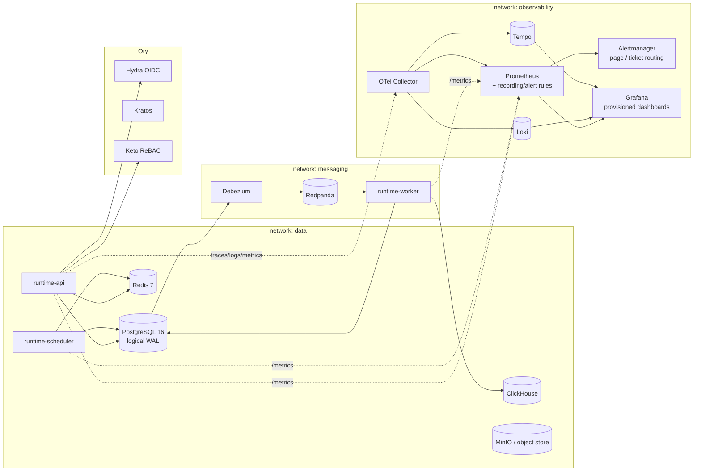

# Infrastructure Diagram

> H-5 — the full infrastructure topology (compose parity of production), including the H-5 monitoring
> additions (Alertmanager, provisioned dashboards, recording/alerting rules). Networks are
> least-privilege planes: `data`, `messaging`, `observability`, `tools`.

## Notes

- **Metrics**: runtime processes expose a native `/metrics` (scraped by the `lumo-runtime` job);
  OTel-instrumented security telemetry flows via the Collector's Prometheus exporter.
- **Alerting**: recording rules compute the SLIs, alerting rules fire against them, Alertmanager
  routes `page`/`ticket` (see [monitoring config](../../../infrastructure/docker/prometheus)).
- **Correlation**: Grafana cross-links traces ↔ logs ↔ metrics by trace id.
- **Isolation**: operator UIs (`tools` plane, omitted above) never join the messaging plane unless
  they operate it; observability services never touch application data stores.
