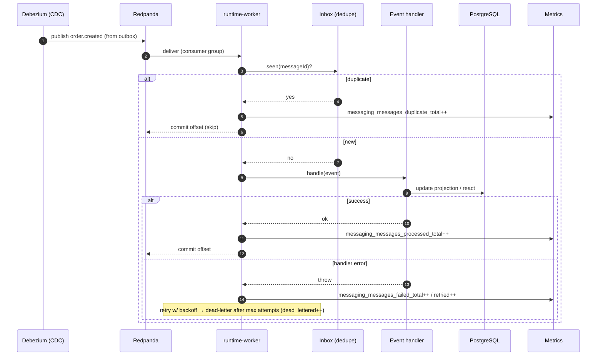

# Sequence Diagrams

> H-5 — the two flows that most define the platform's runtime behavior: an authorized write that
> emits an event via the transactional outbox, and the async consumer path with at-least-once +
> idempotent inbox. These reflect the implemented architecture (outbox/CDC, inbox dedupe, zero-trust
> edge).

## 1 — Authorized write → outbox (synchronous request path)

```mermaid
sequenceDiagram
  autonumber
  participant C as Client
  participant I as Ingress (TLS/headers)
  participant A as runtime-api
  participant E as Edge zero-trust guard
  participant O as Ory (Keto/Hydra)
  participant M as Context module (e.g. Orders)
  participant P as PostgreSQL

  C->>I: POST /api/orders (Bearer JWT)
  I->>A: forward (+ security headers on response)
  A->>E: EvaluateAccess(subject, action, resource)
  E->>O: verify token / check relation (cached)
  O-->>E: permit
  E-->>A: allow
  A->>M: createOrder(cmd)
  M->>P: BEGIN; insert order; insert platform.outbox; COMMIT
  P-->>M: ok (single transaction — no dual-write)
  M-->>A: OrderCreated (id)
  A-->>C: 201 Created
  Note over P: Debezium tails the outbox via logical replication (CDC)
```

## 2 — Async consumer (at-least-once + idempotent inbox)


