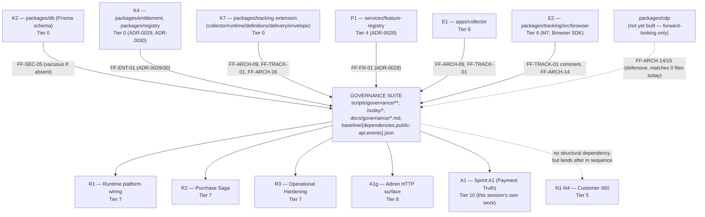

# Governance Position in History

Architecture proof, not an implementation task. No code, Git state, hook, lint-staged config,
governance script, or baseline file was modified while producing this. Every claim below is backed
by a command run against the real repository, quoted inline; nothing is inferred from memory of the
prior sessions' analysis without being re-verified here.

> **Corrections applied 2026-07-27** per `RECOVERY_DOCUMENT_CORRECTIONS.md` (Discrepancies 4–5): §5's
> "Missing packages" bullet undercounted `packages/tracking/src/`'s untracked subdirectories (13
> exist, not 8; all 13 are untracked, not "five of eight") — corrected in place, no change to this
> document's conclusion (the bullet was supporting evidence, not load-bearing on its own). §5's
> "Missing repository structure" bullet and §7's "Governance guarantees" row both falsely claimed
> `.husky/pre-commit`/`.husky/commit-msg` have no commit history — corrected in place: both have been
> committed since `ed3654d` (Sprint 0.2); only the governance-invoking second line and the script
> suite it calls are uncommitted.
>
> **Re-evaluated, not assumed:** this correction touches this document's supporting evidence, not its
> central argument. The Final Verdict (§8 — Governance cannot be positioned earlier than E2) rests on
> `FF-TRACK-01`'s comment text in `scripts/governance/run.mjs` (lines ~390–396) narrating the Browser
> SDK's completed, confirmed architecture as settled fact — independent of `.husky`'s commit history
> and unaffected by it. Re-read directly against the live file during this correction pass
> (`scripts/governance/run.mjs:392-395`: _"M7 now exists, and its actual, confirmed architecture ...
> is that the Browser SDK is a Collector client and NOTHING else ... It never needed the vendor-call
> permission it was reserved for"_) — the comment is unchanged and the argument holds. **The Final
> Verdict is CONFIRMED, with evidence, not carried forward by default.** This document remains
> superseded, as of the same date, by `REPOSITORY_HISTORY_RECOVERY_V2.md`.

## 1. Historical Position

**Governance-as-currently-written cannot be positioned earlier than the completion of milestone E2
(Tier 6 — Browser SDK / M7) in `REPOSITORY_HISTORY_RECOVERY.md`'s dependency order** (its §4, step 19).
This is derived, not assumed, from two independent kinds of evidence:

**(a) Baseline self-reference (mechanical, hard-blocking).** Three checks —`FF-DEP-01`, `FF-API-01`,
`FF-EVT-01` — read `scripts/governance/baseline/{dependencies,public-api,events}.json` and, if the file
is absent, emit a `BLOCK`-severity finding (`missingBaseline`, `run.mjs` lines 36–38). These baselines
do not exist anywhere in git history — confirmed:

```
git ls-files -- scripts/governance/baseline/            → (nothing tracked, ever)
```

This does not by itself dictate a position in the _code_ dependency graph (a baseline can be
established, via `governance:update`, at whatever point Governance itself lands) — but it does mean
Governance's own commit must include establishing that baseline fresh, not reusing today's
already-mid-sequence snapshot (§7).

**(b) Named references to specific, not-yet-existing packages/ADRs (evidentiary, historical-honesty
constraint).** Several checks' CURRENT source text names packages, classes, and ADRs that do not exist
this early in the sequence. Confirmed absent at the frozen `HEAD` (`830138a`):

```
git ls-tree -r HEAD -- docs/architecture/adr
  → 0001 .. 0013, TEMPLATE.md only (no 0028, 0029, 0030, 0032)
git status --porcelain -- packages/entitlement packages/registry services/feature-registry \
                          apps/collector packages/tracking/src/{browser,collector,runtime,execution}
  → all "??" (untracked) — none exist in committed history
```

`scripts/governance/run.mjs`'s own text names `ADR-0028`, `ADR-0029`, `ADR-0030` (in
`checkFeatureRegistryOwnership`/`checkEntitlementEnforcementOwnership`'s finding messages) and
`ADR-0032` (in `checkTrackingSingleIngress`'s comment block). A commit whose diff introduces this exact
text before those ADRs are themselves committed would assert the existence of documents that, at that
point in the reconstructed timeline, do not exist — a factual claim the commit cannot support.

The single latest, hardest constraint is `FF-TRACK-01`'s comment block (`run.mjs` lines 387–399),
which does not merely _reference_ the Browser SDK — it **narrates its confirmed, completed
architecture as settled fact**: _"M7 now exists, and its actual, confirmed architecture ...
is that the Browser SDK is a Collector client and NOTHING else ... It never needed the vendor-call
permission it was reserved for."_ This sentence is only true, and only writable without fabrication,
once E2 (Browser SDK, M7) is complete. This is the binding constraint: everything else Governance
references (K4, K7, P1, E1) lands earlier than E2 in `REPOSITORY_HISTORY_RECOVERY.md`'s own
recommended order (§4, steps 5, 8, 13, 18 respectively), so E2 (step 19) is the last one and therefore
the actual floor.

**Why it cannot appear earlier than E2, restated plainly:** not because the checks would crash (most
would simply find nothing and pass vacuously — proven in §3), but because the _content of the
governance script itself_, as it exists today, contains sentences that are false before E2 exists.
Landing that exact file content earlier would be committing a document that lies about the state of
the repository at that point in the reconstructed history — precisely what
`REPOSITORY_HISTORY_RECOVERY.md`'s own method ("never fabricate history") forbids.

## 2. Governance Dependency Graph

Built from the real, current `scripts/governance/run.mjs`/`lib.mjs`/`api-surface.mjs`/
`layer-cycles.mjs` source — every edge below is a package path, class name, or ADR number that
appears verbatim in that source, not a guess:



**Upstream (Governance depends on, evidenced by name in its own source):** K2 (vacuous-safe), K4, K7,
P1, E1, E2. Confirmed by grepping `run.mjs` for each literal string
(`packages/entitlement`, `services/feature-registry/`, `packages/tracking/src/runtime/`,
`apps/collector/`, `ADR-0028`, `ADR-0029`, `ADR-0030`, `ADR-0032` all appear verbatim in the file
already read in full during this session).

**Downstream (depends on Governance existing to be protected, not on its code):** everything
committed _after_ Governance in the chosen sequence — R1, R2, R3, A1g, A1 in
`REPOSITORY_HISTORY_RECOVERY.md`'s own remaining order (§4, steps 20–24). This is a _temporal_
relationship (Section 4), not a code import — Governance is a hook, not a library; nothing anywhere
in the codebase `import`s from `scripts/governance/`.

**No edge exists** to Tier 2 (Commerce Core v2), Tier 3 (Growth/Experience), or Tier 5
(Customer-360) — none of `run.mjs`'s checks name `services/orders`, `services/cart`,
`services/catalog`, `services/customer-360`, or any other Tier 2/3/5 package. Verified by reading the
full check list (19 checks, all read in full this session) — the only named business-domain packages
are `packages/db` (K2), `packages/entitlement`/`packages/registry` (K4), `services/feature-registry`
(P1), and `packages/tracking`/`apps/collector` (K7/E1/E2).

## 3. Required Predecessors

| Milestone                                                                                                   | Why Governance requires it                                                                                                                                                                                                                                                                                          | Rule that references it                                                         | Effect if missing                                                                                                                                                                                                                                       |
| ----------------------------------------------------------------------------------------------------------- | ------------------------------------------------------------------------------------------------------------------------------------------------------------------------------------------------------------------------------------------------------------------------------------------------------------------- | ------------------------------------------------------------------------------- | ------------------------------------------------------------------------------------------------------------------------------------------------------------------------------------------------------------------------------------------------------- |
| **K2** — `packages/db` Prisma schema                                                                        | `FF-SEC-05` scans `packages/db/prisma/schema/*.prisma` for `tenant_id`                                                                                                                                                                                                                                              | `checkTenantScoping`                                                            | **Not blocking.** `existsSync(schemaDir)` guards the whole check — if the directory doesn't exist, it returns `[]` immediately (confirmed by reading `run.mjs` lines 150–170). Vacuous pass, not a failure.                                             |
| **K4** — `packages/entitlement`, `packages/registry`                                                        | `FF-ENT-01` forbids any file outside `packages/entitlement/` from declaring `class Entitlement(Guard\|Explanation\|Trace\|Simulator)`, citing ADR-0029/0030 by number                                                                                                                                               | `checkEntitlementEnforcementOwnership`                                          | **Not blocking mechanically** (regex finds nothing to flag before K4 exists — a vacuous pass), but the finding message asserts _"the enforcement layer lives only in packages/entitlement"_ — false/premature before K4 is committed.                   |
| **K7** — `packages/tracking` extension (`collector/`, `runtime/`, `definitions/`, `delivery/`, `envelope/`) | `FF-ARCH-09` names `packages/tracking/src/runtime/` as the sole legitimate caller of `receiveAndDeliver`; `FF-TRACK-01`'s `TRACKING_LAYERS` names `packages/tracking/src/{collector,runtime,delivery}/` as vendor-call-exempt; `FF-ARCH-16`'s `NAMED_LAYERS` names 6 of its 8 layers under `packages/tracking/src/` | `checkTrackingSingleIngress`, `checkNoDirectVendorTracking`, `checkLayerCycles` | **Not blocking** (identifiers `receiveAndDeliver`/`ingestTrackingEvent` don't exist anywhere before K7, so the scan matches nothing; the layer-cycle graph has no tracking nodes, so no cycle can be found). Vacuous pass.                              |
| **P1** — `services/feature-registry`                                                                        | `FF-FR-01` forbids any file outside `services/feature-registry/` from declaring `class Feature(Definition\|Bundle\|Group)`/`CapabilityGraph`, citing ADR-0028                                                                                                                                                       | `checkFeatureRegistryOwnership`                                                 | **Not blocking mechanically**, same vacuous-pass reasoning as K4. Message asserts a destination package that doesn't exist yet.                                                                                                                         |
| **E1** — `apps/collector`                                                                                   | `FF-ARCH-09` names `apps/collector/` as the layer that must publish `tracking.event.captured.v1` and execute no pipeline stage; `FF-TRACK-01`'s exempt-layer list includes it                                                                                                                                       | `checkTrackingSingleIngress`, `checkNoDirectVendorTracking`                     | **Not blocking**, vacuous pass (the app doesn't exist, so no file can violate a rule about its internals).                                                                                                                                              |
| **E2** — `packages/tracking/src/browser` (M7)                                                               | `FF-TRACK-01`'s own comment narrates M7's _completed, confirmed_ architecture as settled fact (quoted in §1); `FF-ARCH-14`/`forbiddenCdpSymbolNames` reads `packages/tracking/src/browser/index.ts` if present                                                                                                      | `checkNoDirectVendorTracking` (comment), `checkArch14CdpBarrelBoundary`         | **Not mechanically blocking** (barrel doesn't exist yet → `forbiddenNames.size === 0` → returns `[]`, confirmed in `api-surface.mjs`/`cdpBarrelBoundaryFindings` reasoning). **This is the historical-honesty constraint**, not a runtime one — see §1. |
| **Governance's own baseline establishment** (`governance:update`)                                           | `FF-DEP-01`/`FF-API-01`/`FF-EVT-01` are `BLOCK`-severity when their baseline JSON is absent                                                                                                                                                                                                                         | `missingBaseline()`                                                             | **Blocking.** Not a predecessor milestone — a required _step inside Governance's own commit_ (run `governance:update` once, at that exact point in the sequence, and commit the result).                                                                |

No predecessor in this table causes a hard crash or non-vacuous false-positive if skipped — the
constraint is entirely about **what the committed text of the governance script is allowed to
truthfully say at that point in the reconstructed timeline**, plus the one genuinely mechanical
requirement (baselines must exist, which Governance's own milestone satisfies for itself).

## 4. Protected Successors

Once Governance lands (at the position established in §1), every subsequent commit in the sequence
is evaluated by all 19 checks for the first time. Concretely, for the milestones still to come after
it in `REPOSITORY_HISTORY_RECOVERY.md`'s own order:

| Successor                                           | Protected by                                                                                                                                                                                                                                         | Invariant enforced                                                                                                                                                                                             |
| --------------------------------------------------- | ---------------------------------------------------------------------------------------------------------------------------------------------------------------------------------------------------------------------------------------------------- | -------------------------------------------------------------------------------------------------------------------------------------------------------------------------------------------------------------- |
| **R1** — Runtime platform wiring                    | `FF-TYPE-02/03/04`, `FF-CX-01`, `FF-ARCH-17`, `FF-ARCH-16` (once it composes tracking/cdp)                                                                                                                                                           | No `any`/suppressions in the module registry; no file exceeds the 600-line budget; no package reaches into another's `internal/`; the tracking/CDP layer graph it wires together stays acyclic.                |
| **R2** — Purchase Saga                              | `FF-API-01` (Cart/Checkout/Orders/Payments application-layer types it imports directly), `FF-TYPE-02/03/04`                                                                                                                                          | The saga's dependency on 4 other contexts' public types can't silently drift without `FF-API-01` flagging it — the same mechanism that already, correctly, flagged Sprint A1's `Order` signature change today. |
| **R3** — Operational Hardening                      | `FF-DEP-01` (CI/CD tooling additions go through the dependency freeze)                                                                                                                                                                               | No unapproved external dependency enters via hardening scripts without an explicit `governance:update` approval.                                                                                               |
| **A1g** — Admin HTTP surface                        | `FF-API-01`, `FF-CX-01` (the ~30-context route file is exactly the kind of file this budget exists for)                                                                                                                                              | The admin surface can't silently break any of the ~30 contexts' public APIs it wires, nor balloon past the complexity budget unnoticed.                                                                        |
| **A1** — Sprint A1 (this session's own target work) | `FF-API-01` — **already directly observed**: today's (mis-scoped) hook run flagged `Order`'s and `MarkOrderPaidDeps`' signature changes as breaking, real, live evidence that this exact mechanism is designed to catch exactly this class of change | `Order.completePayment`/`MarkOrderPaidDeps.shadow` become the first change in the reconstructed sequence required to pass an explicit API-stability review rather than landing silently.                       |

Tier 5 (Customer-360, N1–N4) has no structural dependency on Governance and none of its checks
name `services/customer-360` — but placed after Governance in sequence (as §2's graph shows, purely by
sequencing choice, not a hard requirement), it would receive the same generic protections
(`FF-TYPE-02/03/04`, `FF-CX-01`, `FF-ARCH-17`) as everything else committed from that point on.

## 5. Historical Consistency

**Would introducing Governance earlier create historically impossible commits? Yes**, for four
concrete, evidenced reasons — not a general worry, but four specific facts each independently
verified this session:

- **Missing files.** `docs/architecture/adr/0028-feature-registry-freeze.md`,
  `0029-entitlement-guard-enforcement-freeze.md`, `0030-entitlement-evaluation-model-freeze.md`, and
  `0032-universal-event-and-tracking-platform.md` are present in the working tree but **absent from
  every commit in git history**, including `HEAD`. A Governance commit landed before the milestones
  that introduce these ADRs would cite documents that do not yet exist in the reconstructed repository
  at that commit.
- **Missing packages.** `packages/entitlement/`, `packages/registry/`, `services/feature-registry/`,
  `apps/collector/`, and **all 13** of `packages/tracking/src/`'s subdirectories are confirmed
  untracked (`git status --porcelain` → `??` for all of them; corrected 2026-07-27 per
  `RECOVERY_DOCUMENT_CORRECTIONS.md` Discrepancy 5 — the directory has 13 subdirectories today, not
  eight, and 0 of 13 are tracked at `HEAD`, not "five of eight"). A Governance commit landed early
  would contain ownership-freeze rules governing packages that, at that point in history, have never
  been created.
- **Missing APIs.** The specific exported symbols these rules protect —
  `EntitlementGuard`/`explainDecision`/`buildTrace` (K4), `receiveAndDeliver`/`ingestTrackingEvent`
  (K7), the Browser SDK barrel (E2) — do not exist in source form until their respective milestones
  land. A rule enforcing "only X may export this" for a symbol that has never yet been exported
  anywhere is enforcing a fiction.
- **Missing baselines.** `scripts/governance/baseline/*.json` have never been committed
  (`git ls-files` confirms). `FF-API-01`/`FF-DEP-01`/`FF-EVT-01` are `BLOCK`-severity without them —
  landing Governance without simultaneously establishing a baseline for the exact tree state at that
  point would make every subsequent commit fail outright, not pass falsely permissively.
- **Missing repository structure (corrected 2026-07-27, `RECOVERY_DOCUMENT_CORRECTIONS.md`
  Discrepancy 4).** `docs/governance/01–06*.md` (required by `checkGovernanceDocs`) have no commit
  history at all — that part of the original claim holds
  (`git ls-tree -r HEAD -- docs/governance` is empty). **`.husky/pre-commit`/`.husky/commit-msg`
  themselves do not belong in this bullet** — both are tracked at `HEAD` and have been since `ed3654d`
  (Sprint 0.2; `git log --oneline -- .husky/pre-commit` confirms). What genuinely has no commit
  history is narrower: the second line of `.husky/pre-commit` (`node scripts/governance/run.mjs`) and
  the `scripts/governance/**` suite it invokes. Their own presence is part of what Governance's
  milestone must establish, not something it can assume — but the _base hook mechanism_ is not part of
  that gap; it already exists and already runs, unrelated to Governance.

## 6. Validation

**Statement:** _"The repository recovery process should reconstruct historical commits first, then
introduce Governance exactly where it historically appeared."_

**TRUE — with one necessary precision, stated so the claim isn't accepted more broadly than the
evidence supports.**

"Historically appeared" cannot mean _literal calendar chronology_ — that information is unrecoverable
(this repository's real per-sprint dates were never captured in git; `REPOSITORY_HISTORY_RECOVERY.md`
itself works in **dependency order**, not calendar order, for exactly this reason, and says so in its
own method section). Read as "the dependency-justified position established by the evidence in §1–3
of this document," the statement is true and is directly supported:

- §3 shows every one of Governance's named dependencies (K4, K7, P1, E1, E2) must exist first, or the
  script's own committed text would assert facts that are false at that point in the sequence.
- §5 shows the concrete, checkable failure modes (missing ADRs, missing packages, missing exported
  symbols, missing baselines, missing repository structure) that would result from landing it earlier.
- §4 shows landing it _later than necessary_ is not required and has a real cost — every commit
  between the earliest valid point (after E2) and wherever it actually lands goes unprotected. This is
  why the statement says "exactly where," not "as late as possible": the correct position is a specific
  point (after E2, before R1/R2/R3/A1g/A1), not merely "somewhere, eventually."

The statement would be **false** only under a stricter reading — "after literally everything else" —
which §2's dependency graph disproves: Tier 5 (Customer-360) has no dependency relationship with
Governance in either direction, so there is no requirement it precede Governance.

## 7. Recovery Strategy Verification

Validating the previously proposed strategy — **temporary recovery branch + linked git worktree**,
zero modification to any hook/lint-staged/governance/baseline file — against the five named
properties, now specifically informed by the E2 placement finding in §1:

| Property                     | Preserved?                                          | Reasoning                                                                                                                                                                                                                                                                                                                                                                                                                                                                                                                                                                                                                                                                                                                                                                                                                                           |
| ---------------------------- | --------------------------------------------------- | --------------------------------------------------------------------------------------------------------------------------------------------------------------------------------------------------------------------------------------------------------------------------------------------------------------------------------------------------------------------------------------------------------------------------------------------------------------------------------------------------------------------------------------------------------------------------------------------------------------------------------------------------------------------------------------------------------------------------------------------------------------------------------------------------------------------------------------------------- |
| **Git history correctness**  | **Yes**                                             | Commits are constructed on a branch distinct from `main`, reviewed per-milestone (per the standing "stop after each milestone" discipline already in effect this session), and only fast-forwarded once approved. Nothing about the branch/worktree mechanism itself alters commit content — it only changes which files are physically present when each commit is made.                                                                                                                                                                                                                                                                                                                                                                                                                                                                           |
| **Governance guarantees**    | **Yes, and more accurately than today's live hook** | A worktree checked out at each point in the sequence has, on disk, only what that point in _reconstructed_ history actually contains. **Corrected 2026-07-27** (`RECOVERY_DOCUMENT_CORRECTIONS.md` Discrepancy 4): before Governance's own milestone (positioned after E2, per §1), the worktree _does_ have a real `.husky/pre-commit` to invoke — the base `pnpm lint-staged`-only version, committed since `ed3654d`/Sprint 0.2 — which runs correctly on every commit from that point on. What does not exist that early is the _governance_ line/suite specifically (no recoverable commit history for it, same as before). After Governance's milestone lands within that same branch, every subsequent worktree commit is additionally gated by the real, unmodified 19-check suite on top of the lint-staged step that was already running. |
| **Architecture integrity**   | **Yes**                                             | No architectural decision is encoded differently by this strategy — it is purely a sequencing/execution mechanism. The dependency graph in §2, derived from the _unmodified_ source, is exactly what will be enforced once Governance lands; nothing about worktree-based commit construction changes what any check looks for.                                                                                                                                                                                                                                                                                                                                                                                                                                                                                                                     |
| **Public API integrity**     | **Yes, conditionally on one required action**       | `FF-API-01` will correctly gate every commit **after** Governance's baseline is established — but that baseline must be generated fresh, via `governance:update` run _inside the worktree, at the exact tree state immediately after Governance's milestone's own predecessor commits_ (i.e., after E2, not using today's already-mid-sequence `scripts/governance/baseline/public-api.json`, which is dated today and already contains Tier 2's Orders surface — see the original analysis document §3). This is a required step of Governance's own milestone commit, not yet performed, and not something this document implements.                                                                                                                                                                                                              |
| **Event-contract integrity** | **Yes, same conditional as above**                  | `FF-EVT-01` behaves identically to `FF-API-01` for this purpose — its baseline (`events.json`) must likewise be freshly established at Governance's correct historical point, not reused from today's snapshot.                                                                                                                                                                                                                                                                                                                                                                                                                                                                                                                                                                                                                                     |

**Remaining risks, stated plainly:**

1. **No automated quality enforcement exists for commits K1 through E2.** This is the direct,
   accepted consequence of §1's finding — those commits genuinely predate any recoverable hook
   history. Any latent `any`/complexity/dependency issue already present in that code will not be
   caught by this process. This is historically accurate, not a defect in the strategy, but it is a
   real gap the user should be aware is being accepted, not hidden.
2. **Governance's own milestone placement (immediately after E2, vs. folded into R3 Operational
   Hardening, vs. its own standalone step between E2 and R1) is still an open choice** — §1–§4
   establish the _earliest valid_ and _functionally sufficient_ position, not a single forced exact
   slot. This needs your confirmation before execution, as previously flagged.
3. **Per-worktree `pnpm install` cost** — unchanged from the prior analysis, an operational cost, not
   a correctness risk.
4. **The re-baseline step for `governance:update` must be performed at exactly the right tree state**
   (immediately after Governance's predecessors, before its successors) — doing it too late (e.g.,
   against the full current working tree) reproduces today's exact failure mode. This is a procedural
   discipline risk, not a tooling limitation.

## 8. Final Verdict

**Governance must be introduced after milestone E2 (Tier 6 — Browser SDK, M7).**

Equivalently: after `REPOSITORY_HISTORY_RECOVERY.md` §4's step 19, once K4, K7, P1, E1, and E2 all
exist in the reconstructed sequence — with E2 as the binding constraint, evidenced by `FF-TRACK-01`'s
own comment text narrating M7's completed architecture as settled fact. It may land any time after
that point and before R1 (step 20), or be folded into R3 (Operational Hardening) if you prefer to
group it there — both are consistent with the dependency graph in §2; neither is dictated by it.

**Reconfirmed 2026-07-27** after correcting the `.husky` and tracking-subdirectory factual errors
described in the banner at the top of this document — neither correction touches the `FF-TRACK-01`
evidence this verdict is actually built on, so the verdict is unchanged, and is stated here as
confirmed-with-evidence rather than carried forward unexamined.

No code, Git history, hook, governance script, lint-staged config, or baseline file has been
modified. Stopping here as instructed.
