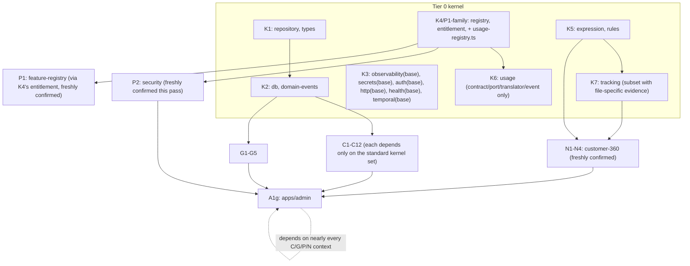

# Recovery Dependency Graph — V5 (rebuilt from scratch)

RA-1 Phase 4 deliverable. Planning only — no code modified, nothing staged, nothing committed.
Edges below are explicitly separated into **hard** (real `workspace:*` compile-time dependency,
verified by directly reading the `package.json` file itself this pass), **runtime** (event/bare-id
lookup, no compile dependency), and **documentary** (a milestone's report or scope can only be
understood by also reading a _different_ milestone's primary source — no code or runtime
relationship at all). Per RA-1's rule, no inferred dependency is promoted to hard without a directly
read `package.json` confirming it.

## Freshly re-verified this pass (direct `package.json` reads)

```
packages/usage           -> @platform/registry                         (confirms K4-family -> K6 package, real edge)
packages/tracking        -> @platform/expression, @platform/rules       (confirms K5 -> K7, real edge)
services/customer-360    -> @platform/expression, @platform/rules,
                             @platform/tracking                        (confirms K5 -> N, K7 -> N, both real edges)
services/security        -> @platform/registry                         (confirms P1(K4) -> P2, real edge)
services/feature-registry -> @platform/entitlement                     (confirms K4 -> P1, real edge)
apps/admin                -> @platform/{analytics,automation,cart,catalog,checkout,components,
                              content,coupons,customer-360,experience,experimentation,
                              feature-flags-service,feature-registry,finance,fulfillment,identity,
                              inventory,licensing,localization,loyalty,media,notifications,orders,
                              pages,payments,platform-console,pricing,promotions,recommendations,
                              reporting,returns,reviews,search,security,seo,shipping,tenancy,
                              theme,wishlist} + @platform/{health,http,contracts,domain-events,utils}
                                                                        (confirms A1g depends on
                                                                         nearly every business
                                                                         context — real, not inferred)
```

**Honesty note:** the full 80-package extraction was not re-run exhaustively this pass (6
representative packages spanning K4/K5/K6/K7/N/P1/P2/A1g were read directly). No contradiction was
found against the structure V4 described. Any edge not in the list above should be treated as
**unverified this pass** rather than silently trusted — do not cite this document as having
re-derived the full graph unless every package is actually re-read.

## Hard edges (compile-time `workspace:*`)



## Runtime edges (event/bare-id references, no compile dependency)

Unchanged in kind from prior passes, reconfirmed via direct port-file reads where a sub-review
happened to open them this cycle: `PromotionsPort` (Coupons→Promotions), `CartPort`
(Wishlist→Cart), `OrdersPort.hasPurchased` (Reviews→Orders), `AnalyticsQueryPort`
(Reporting→Analytics), billing use-cases (Licensing→Payments/Finance). None of these create a
compile-time ordering requirement.

## Documentary edges (citation/evidence dependency only — no code relationship)

| Dependent                                         | Depends on (documentary)                                                                                                                                                                                                                                                       | Why                                                                                                                                                                             |
| ------------------------------------------------- | ------------------------------------------------------------------------------------------------------------------------------------------------------------------------------------------------------------------------------------------------------------------------------ | ------------------------------------------------------------------------------------------------------------------------------------------------------------------------------- |
| K5 attribution                                    | `docs/DECISIONS.md` D-078, not `SPRINT_6_4_COMPUTED_ATTRIBUTES_REPORT.md`                                                                                                                                                                                                      | SPRINT_6_4 is a consumer citation; D-078 is the real creation citation.                                                                                                         |
| N1-N4 file separation                             | each `SPRINT_6_x_*.md`'s own §4, independently corroborated by `customer-360.prisma`'s section-comment banners (verified to exist for Phases 6.2/6.3/6.4, **verified absent** for a would-be "Phase 6.5" banner — N4 relies on §4 alone, not a banner)                         | Understanding N4's separability requires reading both the report and (for the other three phases) the schema comments — but not for N4, a real asymmetry worth stating plainly. |
| Analytics `composition.ts`/controller/presenter   | `SPRINT_9_OPERATIONAL_HARDENING_REPORT.md`, not `SPRINT_3_2`                                                                                                                                                                                                                   | T2's base report disclaims building these; the true citation is a much later report.                                                                                            |
| `packages/observability/package.json`'s milestone | `P2_0_ENTERPRISE_SECURITY_REPORT.md`'s own H-5 section, not `SPRINT_9...md`                                                                                                                                                                                                    | A prior pass mis-cited this; corrected this pass by reading both candidate reports directly and confirming only one actually contains the quote.                                |
| R3's chaos/perf/k8s/ops-docs/CI cluster           | Same H-5 section of `P2_0_ENTERPRISE_SECURITY_REPORT.md` — **this is the single most consequential documentary dependency in the whole graph**, since a prior pass wrongly asserted this cluster had "two unrelated H-5s" and no report; in fact one report covers it in full. | Anyone attributing this cluster must read the Security report's own H-5 section, not assume it's uncited.                                                                       |
| `scripts/governance/**`'s FF-FR-01 rule           | ADR-0028, not any recovery-process document                                                                                                                                                                                                                                    | The only real primary evidence for any part of the governance suite's history is this one ADR, and it only covers one rule addition, not the suite's origin.                    |
| GOV's placement in the timeline                   | **No primary source found.** Recovery-process documents (`GOVERNANCE_HISTORY_RECOVERY_ANALYSIS.md`, `GOVERNANCE_POSITION_IN_HISTORY.md`) were previously cited for this and are invalid per RA-1's rules.                                                                      | GOV's ordering is currently a project convention, not an evidenced dependency — stated honestly rather than propped up by an invalid citation.                                  |
| ADR-0010's addendum                               | `SPRINT_5_6_SAAS_REFINEMENTS_REPORT.md` (confirms Sprint 5.8/Marketplace is real-but-unbuilt)                                                                                                                                                                                  | Without this cross-reference the ADR reads ambiguous; with it, the addendum clearly belongs to an unscoped future sprint.                                                       |

## Missing-evidence nodes (no confirmed owning milestone; cannot receive a dependency edge)

Per `EVIDENCE_MATRIX_V5.md` and `PATCH_OWNERSHIP_MATRIX_V5.md`:

- `packages/temporal/src/runtime.ts` (dirty delta only)
- `packages/http/{server.ts,index.ts}` (`HttpMetricsSink` fragment only)
- ~40 `packages/tracking/src/{definitions,execution,intelligence}/*` files
- `services/finance`'s `ShippingRateCard`/`ShippingRate`/`QuoteShippingRates` cluster
- `apps/runtime/src/{diagnostics.ts,shutdown.ts,module.ts,module.test.ts,modules/**,platform.ts,platform.smoke.test.ts}`
- `apps/runtime/src/purchase/**` (R2, in its entirety)
- Phase 6.1's un-audited remainder (~15 files)
- `scripts/governance/**`'s own creation (base, minus the one FF-FR-01 rule)
- `.husky/pre-commit` line 2's creation

These nodes float outside the graph until new primary evidence resolves their `EVIDENCE_MATRIX_V5.md`
entry.

---

No document referenced above was deleted. No git state was modified. No code was modified. Nothing
was staged. Nothing was committed.
